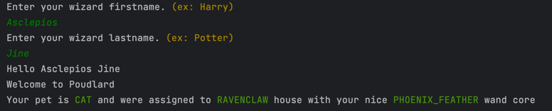
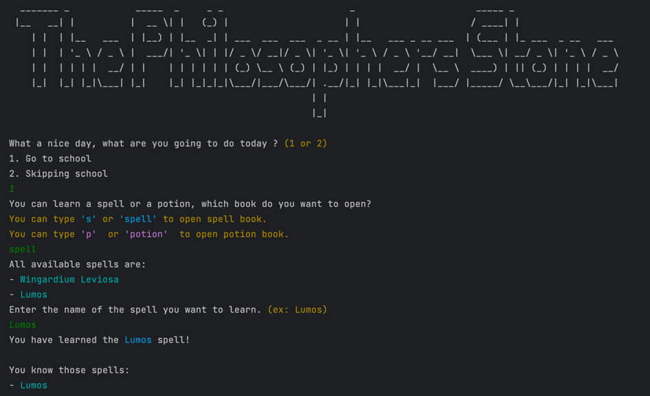
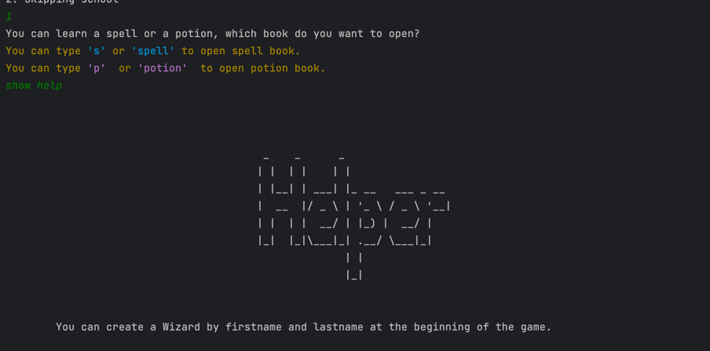
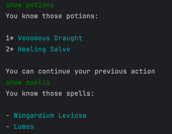
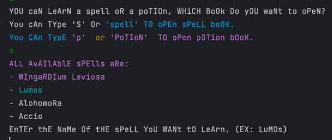

# Welcome to Harry Potter at Home

## Game implementation in java using OOP

What is it ?

This code is my version of a Harry Potter Game using java. 
This is in for the algorithms and programming lecture my engineer studies ISEP, Paris.

To start the game you have to enter your first and last name to be accepted at Poudlard.

All houses have their own specialties which can help you during the aventure.

Then start your first day at school. You can learn spells or potions there. Those which are available depend on your current wizard year.

During your aventure you also can ask for help by typing "show helper"

You can also see your known spells or potions at any moment :

Be careful to boss, do not skip school too much, and to some visual and auditive distortion ;)

